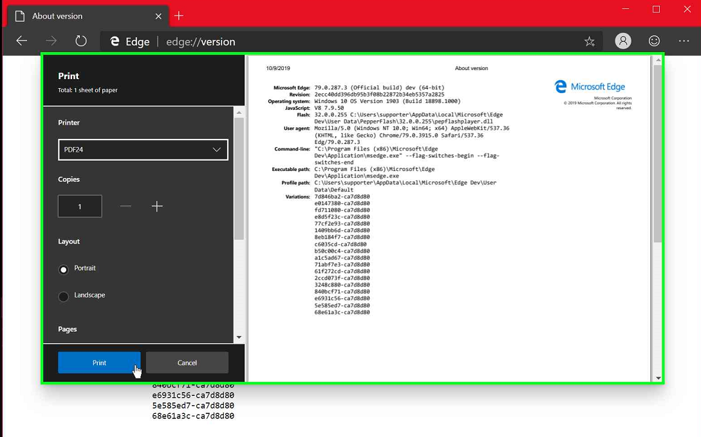
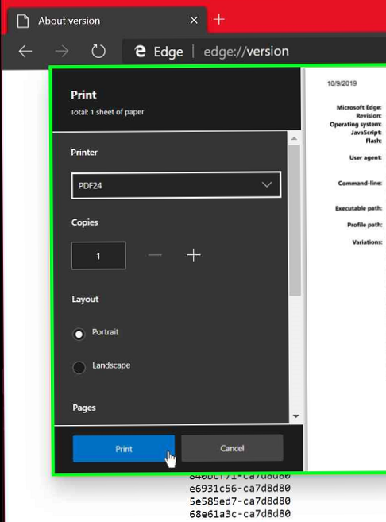
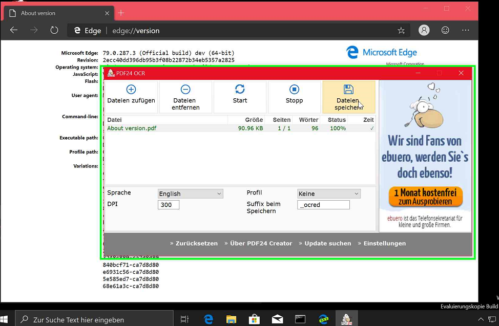
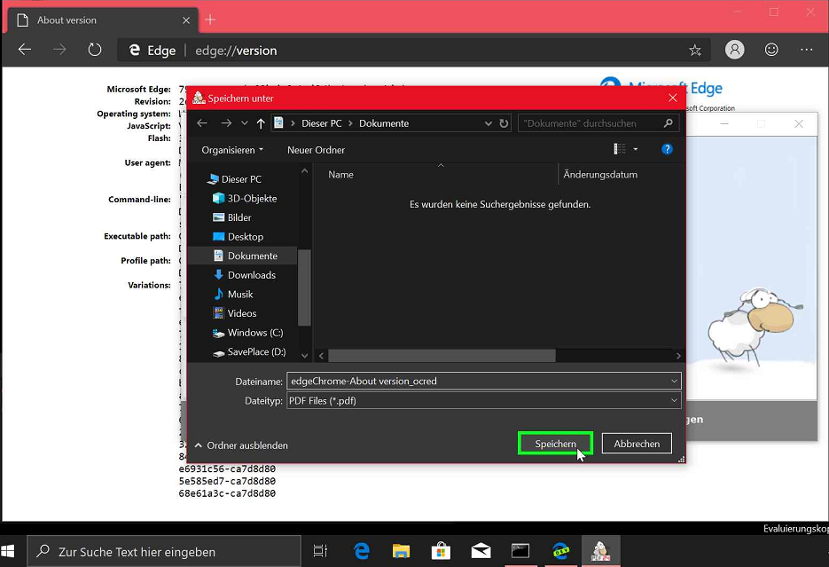

Windows 10 hat nebst seinem XPS Druckertreiber, seit längerem ein PDF Druckertreiber dabei. Dennoch benutze ich seit Jahren das kostenlose Tool [PDF24](https://de.pdf24.org/). Dort hat im August dieses Jahr ein Update dem Tool ein neues Feature geschenkt: OCR.  

[Abbyy FineReader](https://www.abbyy.com/de-de/finereader/) ist nach Meinung vieler Fachleute seit Jahren die beste OCR Software. Und wer eine vollständige Lösung sucht, ist mit dem aktuellen Blogartikel ["Papierloses Büro dank Synology Diskstation und OCR-Scanner"](https://technikblog.ch/2019/08/papierloses-buero-dank-synology-diskstation-und-ocr-scanner/) von Hans Fischer sicher sehr gut bedient.  

## Ablauf  

Über das drucken eines Dokumentes eine PDF Datei zu erstellen, setze ich als bekannt voraus. Nachfolgend die Schritte aus einer Anwendung zum Dokument. Die Erweiterung "_ocred" ist für mich nützlich, damit ich sofort erkenne was bereits durchsuchbar ist.  

Die Auflösung von 300 DPI ist eher zu hoch. In den meisten Fällen (gedruckte Dokumente) reichen 150 DPI aus. Es wirkt sich natürlich auf die Grösse des Dokumentes aus.  

1.   
2.   
3.   
4.   
5.   

## Fazit

Wer eine schnelle, einfache und kostenlose Lösung sucht, um durchsuchbare PDF unter Windows zu erstellen sollte PDF24 testen.  

## Meta

Erstellt:		9. Oktober 2019  
Modifiziert:	9. Oktober 2019
