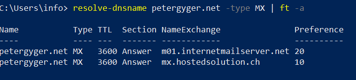

## Meta

Erstellt:	    30. November 2019  
Modifiziert:	30. November 2019

## Überblick 

Wenn eine Mailadresse über einen Exchange Server läuft, muss die Konifiguration des E-Mail Programmes in der App um ein weiteres Feld ergänzt werden. Dieses heisst "Domäne/Benutzername". Mir ist es in den letzten Jahren zweimal passiert, dass die Konfiguration verloren ging. Daher diese kurze Anleitung. Notiz an mich selbst.  

  

Wenn der MX Record auf den gleichen Domainnamen lautet verwendet man diesen. Beispiel:  
E-Mail:			        max.musterman@beispiel.ch
Domäne/Benutzername:	beispiel.ch

Wenn das nicht der Fall ist, dann muss die Antwort eingeholt werden. Beispielsweise mit einem der folgenden Möglichkeiten:  

Webservice:			[MXToolbox.com](https://mxtoolbox.com/MXLookup.aspx)  

Windows Shell CMD:		Mit dem Befehl NSLookup (NameServer Lookup)  

  

Windows Shell Powershell:	 
Die CMD Version funktioniert auch in der Powershell. Jedoch hat Powershell dafür das Cmcdlet "Resolve-DnsName". Die Ausgabe wird in diesem Beispiel durch den Befehl "ft -a" komprmiert.  

  

D.h. in meinem Fall muss ich für "Domäne/Benutzername" den Server "hostedsolution.ch" eintragen. Ein anderes Beispiel mit dieser Mailserver Konstallation ist die Website "Computerbase.de". Man kann diese Befehle auch mit dieser URL durchspielen. 

"DIG" ist die Linux Version von NSLookup. Sie hat noch etwas mehr Möglichkeiten und lässt sich auch unter Windows installieren

# Quellen   

[RFC 974-MAIL ROUTING AND THE DOMAIN SYSTEM](https://tools.ietf.org/html/rfc974)

[MX Lookup using command-line](https://medium.com/@petehouston/mx-lookup-using-command-line-3affc2c2de87)  

[Resolve-DnsName, Get-DnsClientCache: DNS-Fehlersuche mit PowerShell](https://www.windowspro.de/script/resolve-dnsname-get-dnsclientcache-dns-fehlersuche-powershell)

[YT-Install dig DNS tool on Windows](https://www.youtube.com/watch?v=fqvGt5S6JDI)  